 

<picture>
  <source media="(prefers-color-scheme: dark)" srcset="assets/experience-dark.svg" />
  <source media="(prefers-color-scheme: light)" srcset="assets/experience-light.svg" />
  
</picture>

 

I'm a Full-Stack Developer with **<!-- EXPERIENCE-TEXT:START -->1 year 9 months<!-- EXPERIENCE-TEXT:END -->** of experience building **SaaS applications**. I ship features end to end — from database to UI — and I'm comfortable owning a feature from the data model all the way to the screen.

- ⚛️ **Frontend:** **React.js** and **Next.js** with **TypeScript** — Redux Toolkit, RTK Query, schema-driven forms (React Hook Form + Zod), Material UI, Radix UI, shadcn/ui and Tailwind CSS
- 🛠️ **Backend:** **Ruby on Rails 8** or **Node.js + Express.js** — REST APIs, JWT authentication, and background jobs with Sidekiq and Redis
- 🗄️ **Data & cloud:** **PostgreSQL** and DynamoDB, with AWS Cognito and AWS Amplify for authentication and hosting

I care about clean, reusable architecture and writing code the next engineer can pick up quickly — building secure, well-tested features with a focus on performance and a great user experience.

 

<picture>
  <source media="(prefers-color-scheme: dark)" srcset="assets/about/strengths-dark.svg" />
  <source media="(prefers-color-scheme: light)" srcset="assets/about/strengths-light.svg" />
  
</picture>

 

  <a href="https://gopinath.d1ktv8k6cbll9k.amplifyapp.com/"><picture><source media="(prefers-color-scheme: dark)" srcset="assets/connect/portfolio-dark.svg" /><source media="(prefers-color-scheme: light)" srcset="assets/connect/portfolio-light.svg" /></picture></a>
  <a href="https://linkedin.com/in/gopinath-24b2a7292"><picture><source media="(prefers-color-scheme: dark)" srcset="assets/connect/linkedin-dark.svg" /><source media="(prefers-color-scheme: light)" srcset="assets/connect/linkedin-light.svg" /></picture></a>
  <a href="https://github.com/gopinath-2405"><picture><source media="(prefers-color-scheme: dark)" srcset="assets/connect/github-dark.svg" /><source media="(prefers-color-scheme: light)" srcset="assets/connect/github-light.svg" /></picture></a>
  <a href="mailto:gopi63669@gmail.com"><picture><source media="(prefers-color-scheme: dark)" srcset="assets/connect/email-dark.svg" /><source media="(prefers-color-scheme: light)" srcset="assets/connect/email-light.svg" /></picture></a>
  <a href="https://gopinath.d1ktv8k6cbll9k.amplifyapp.com/Gopinath_Resume.pdf"><picture><source media="(prefers-color-scheme: dark)" srcset="assets/connect/resume-dark.svg" /><source media="(prefers-color-scheme: light)" srcset="assets/connect/resume-light.svg" /></picture></a>

 

<picture>
  <source media="(prefers-color-scheme: dark)" srcset="assets/skills/tech-stack-dark.svg" />
  <source media="(prefers-color-scheme: light)" srcset="assets/skills/tech-stack-light.svg" />
  
</picture>

 

<picture>
  <source media="(prefers-color-scheme: dark)" srcset="assets/education-dark.svg" />
  <source media="(prefers-color-scheme: light)" srcset="assets/education-light.svg" />
  
</picture>

 
 

